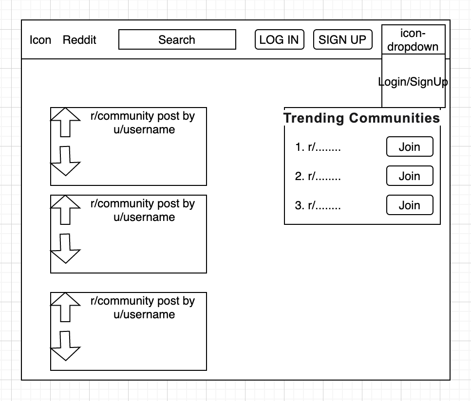
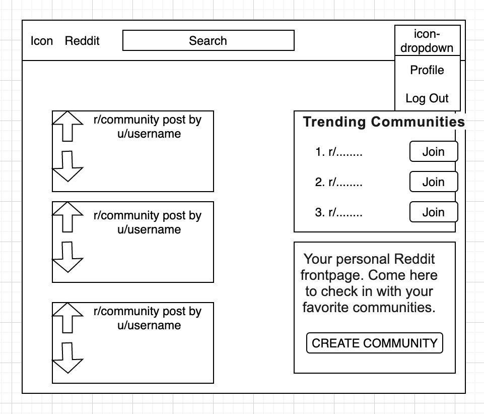
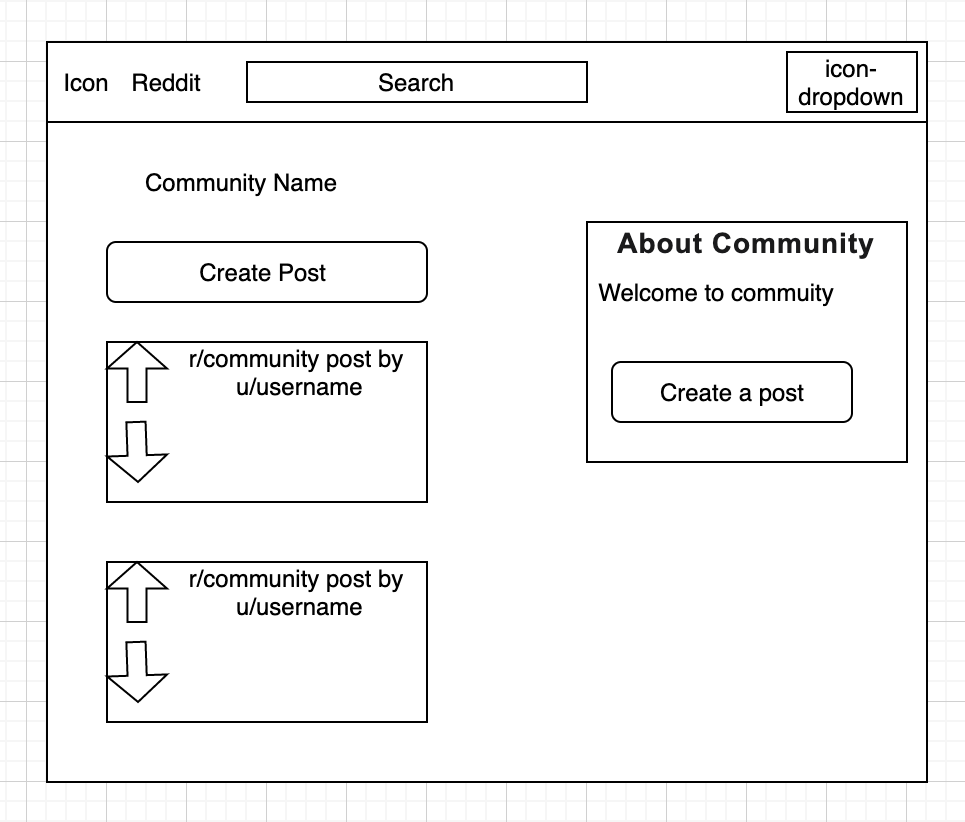
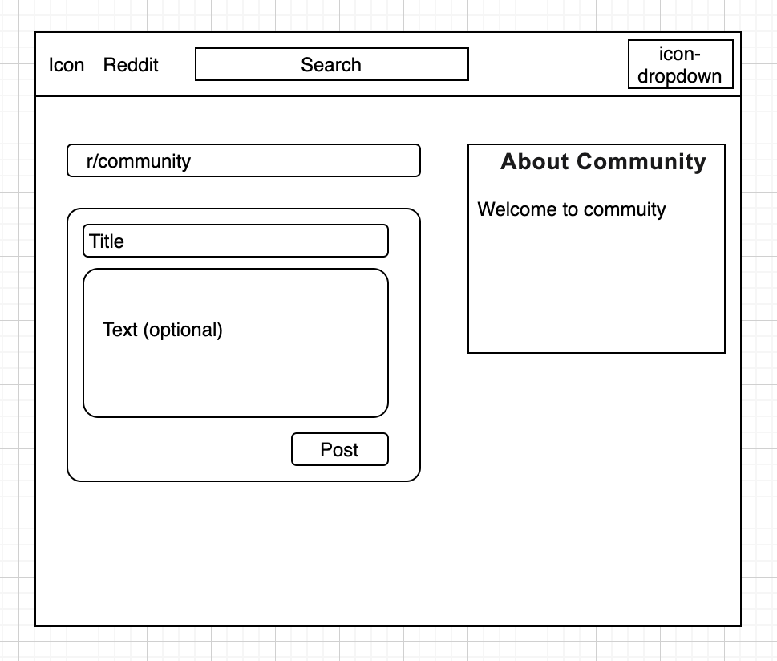
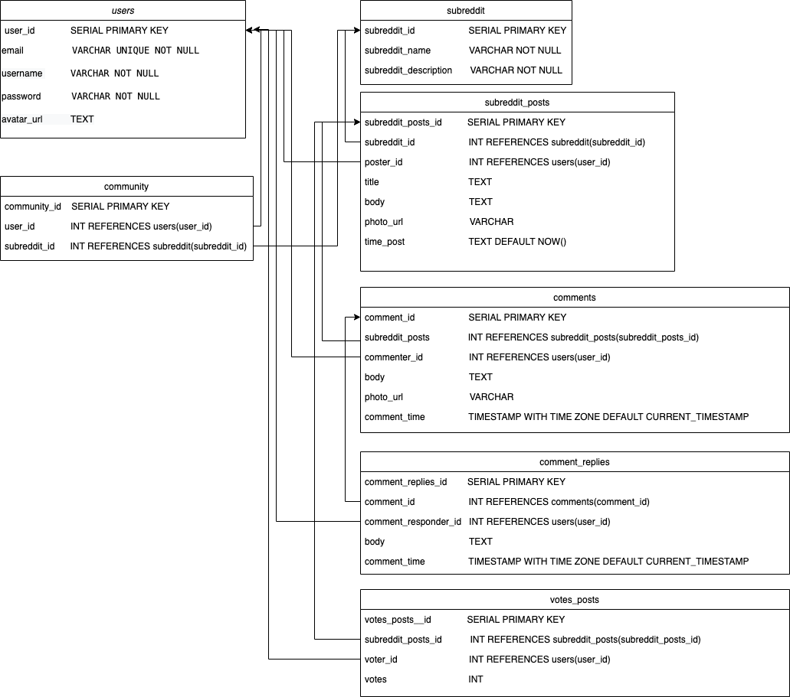

# Reddit Clone

This Reddit Clone app is meant to replicate Reddit.

## Features

Users are able to:

* Sign up and login in to an existing account.
* Create a new subreddit.
* Create a new post on a subreddit.
* Upvote/Downvote on a post.


## Technologies Used

* React.js
* CSS3 & Material UI
* Node.js & Express.js
* PostgreSQL 
* Passport.js
* pg-promise
* bcrypt

##  Local Setup

You must have installed Node.js and PostgreSQL in your computer.
You can check for these dependencies with node -v and psql -v. 

+ To run, first instantiate and seed the PostgresQL database from the root:
  ```
  $ psql -f database/seed.sql
  ```

+ Second, install and run the backend locally using npm:
  ```
  $ cd server
  $ npm install
  $ npm run start:dev
  ```

+ Lastly, install and run the frontend locally using npm:
  ```
  $ cd ../../client
  $ npm install
  $ npm start
  ```


## Wireframes







 ## Database Schema

